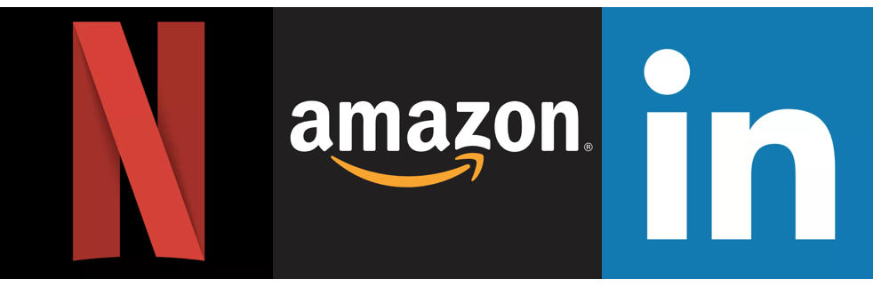

# Small-Scale Recommendation System Prototypes
Five different types of recommendation systems used by Netflix, Amazon, LinkedIn, etc.

Each script is in OOP form. The system returns recommendations in pandas DataFrame format.

## The Code
The following five types of recommendation systems are implemented, with each in a different script file:
1. Popularity-based recommendation: Recommends items based on how 'popular' they are (impersonal).
2. Correlation-based recommendation: Recommends items based on Pearson correlation between another from previous user ratings.
3. Classification-based collaborative filter: Uses logistic regression to give personalized recommendation.
4. Model-based collaborative filter: Build model from user ratings, make recommendations from model.
5. Content-based recommendation: Recommends items based on feature similarity. Uses kNN.

## System API
Each recommendation system uses the following interface:
* init: generates an instance of the system.
* generate_recommendations(n): outputs a pandas DataFrame with n rows of recommendations (1 per row).

## The Models
The first 2 systems create simple recommendations based on activity of previous users.
The last 3 systems use machine learning to aid in generating personalized suggestions. The Logistic Regression and k Nearest Neighbors models are in Python, based on pseudocode written by Johnathan Shewchuk in [Concise Machine Learning.](https://people.eecs.berkeley.edu/~jrs/papers/machlearn.pdf). The Singular Value Decomposition for model-based recommendation is implemented using scikit-learn.

## The Data
Dataset taken from UCI machine learning repository. [link](https://archive.ics.uci.edu/ml/datasets/Restaurant+%26+consumer+data)

## Dependencies
numpy 1.15.4, scipy 1.1.0, pandas 0.23.4

Dependencies used for acceleration of calculations. All systems/models built from scratch and can be built without libraries.
